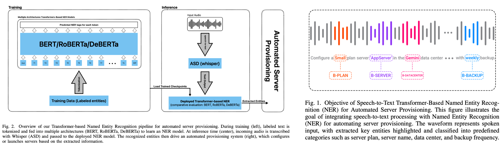

# [[ICWR 2025]](https://ieeexplore.ieee.org/document/11006240) Transformer-Based Named Entity Recognition for Automated Server Provisioning
_Hossein Damavandi, Hasan Jalali, & Boshra Pishgoo_

🚀 Official implementation for **Transformer-Based Named Entity Recognition for Automated Server Provisioning**.

This repository demonstrates a framework that bridges **voice commands** to **server configurations** using advanced transformer models. The approach extracts and processes key entities required for provisioning automated, scalable, and intelligent infrastructure solutions.

---

**📄 For more details, refer to the paper on [IEEE Xplore](https://ieeexplore.ieee.org/document/11006240).**  
**🔓 The full-text is also available on [ResearchGate](https://www.researchgate.net/publication/391998332_Transformer-Based_Named_Entity_Recognition_for_Automated_Server_Provisioning).**

---

## Try the Demo

Extract entities from **voice** and **text** using the app: [[HERE]](https://colab.research.google.com/drive/1RpFiUarl5YCsKtCq0cxrucrkXOpIrpxd?usp=sharing).


## The Architecture




## Dataset

The dataset used for training and evaluation is located in the [dataset directory](/dataset).

## Train

The training code is available in [training.ipynb](training.ipynb).

## Inference

The inference code is available in [inference.ipynb](interface.ipynb).


## Citation
If you use this work in your research, please cite:

```
@inproceedings{damavandi2025transformer,
  title={Transformer-Based Named Entity Recognition for Automated Server Provisioning},
  author={Damavandi, Hossein and Jalali, Hasan and Pishgoo, Boshra},
  booktitle={2025 11th International Conference on Web Research (ICWR)},
  pages={534--540},
  year={2025},
  organization={IEEE}
}
```
## Contact
For any inquiries or contributions, please contact hossein.damavandi@email.kntu.ac.ir or hasanjalali@ut.ac.ir.

